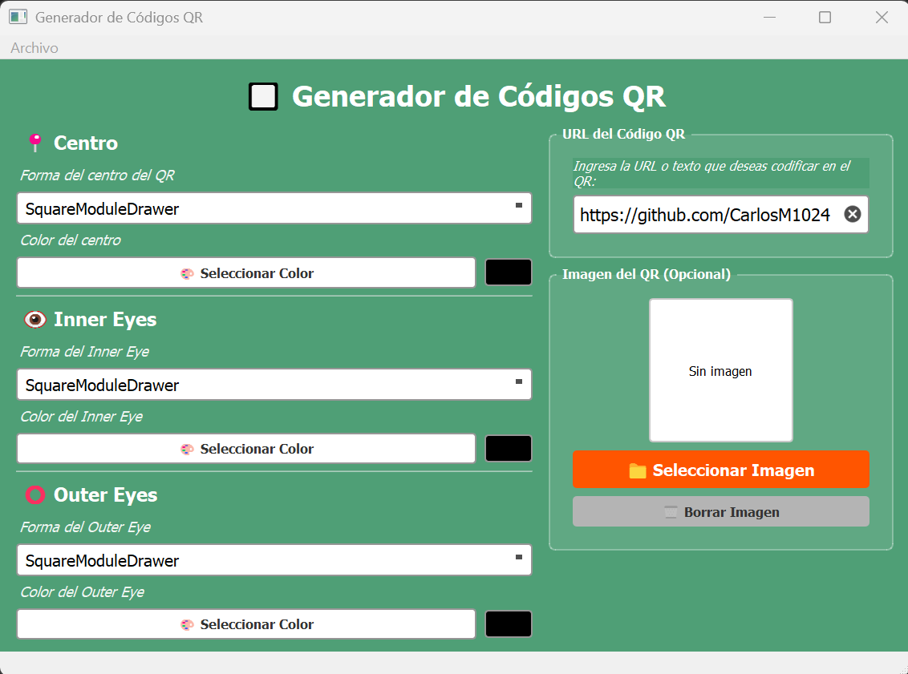

# 📱 QR_Generator

[](https://opensource.org/licenses/MIT)
[](https://www.python.org/downloads/)
[](https://github.com/CarlosM1024/QR_Generator/pulls)

---

## 📝 Description

**QR_Generator** is a lightweight Python-based tool designed to custom high-quality QR codes. This project focus on simplicity and efficiency, providing a command-line interface to generate assets ready for digital or print use.

---

## ✨ Features

* **Instant Generation:** Convert any URL into a `.png` QR code in seconds.
* **Batch Ready:** Designed to be easily integrated into larger Python workflows.
* **Template Support:** Includes a `plantillas/` directory for future customization of QR styles.

---

## 📸 Screenshots

<p align="center">
    
</p>

---

## 📁 Directory Structure

```text
QR_Generator/
├── scripts/       # Core Python logic and main execution scripts
├── out/           # Destination folder for generated QR images
├── plantillas/    # Templates for QR styling (e.g., logos, colors)
├── .gitignore     # Git ignore rules
├── LICENSE        # MIT License
└── README.md      # Project documentation
```

---

## 🚀 Getting Started

### Prerequisites

* `Python 3.9`
* `Qt Designer`
* `PyQt5 and qrcode` libraries

### Installation

1. Clone the repository:

    ```bash
    git clone https://github.com/CarlosM1024/QR_Generator.git
    ```

2. Navigate to the project directory:

    ```bash
    cd QR_Generator
    ```

3. Install dependencies:

    ```bash
    pip install qrcode pyqt5
    ```

---

## 🛠️ Usage

1. Run the main script:

    ```bash
    python scripts/QR_Generator.py
    ```

2. The QR code will be generated and we recommend to be saved in the `out` directory.

---

## 📄 License

This project is licensed under the MIT License - see the [LICENSE](LICENSE) file for details.

---

## 🤝 Contributing

If you'd like to contribute to this project, feel free to submit a pull request. Please make sure your code follows the existing style and includes appropriate comments.

1. Fork the repository.
2. Create a new branch for your feature or bug fix.
3. Commit your changes.
4. Push to the branch.
5. Submit a pull request.

---

## 👤 Author

**Carlos Antonio Martinez Miranda**

GitHub: [@CarlosM1024](https://github.com/CarlosM1024)
